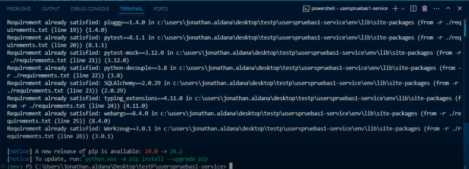
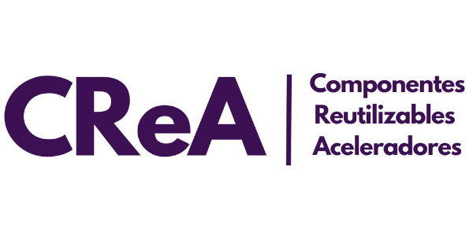

# Generator Python
- Proyecto generado para la configuración automática de microservicios con python.
Los generadores de Python son funciones especiales que devuelven un iterador de Python.La creación de generadores de Python es similar a la definición de funciones normales , sin embargo, algunos de los detalles son ligeramente diferentes.

## INDICE

1. [Requerimientos de Software](#Requerimientos_de_Software)
2. [Instalación del proyecto](#Instalación_del_proyecto).
3. [Configuración CMD](#Configuración_CMD)
4. [Docker](#Docker)
5. [Configuración Python](#Configuración_Python)
6. [Ejecución en la base de datos](#Ejecución_en_la_base_de_datos)
7. [Estructura del Framework](#Estructura_del_Framework)
8. [Contribución](#Contribución)
9. [Créditos](#Créditos)
10. [Licencia](#Licencia)
11. [Contacto](#Contacto)

## Requerimientos de Software

* Instalar NodeJs LTS : (https://nodejs.org/es/)
  
-Nota: las siguientes ejecuciones se instalan por comandos CMD.
  
* Instalar Yeoman
    `npm install -g yo`
* Descargar dependencias 
    `npm install`
* Ejecutar dentro de generator-python/
    `npm link`

## Instalación del proyecto

- Ejecutar el comando: `yo python`  

- En el archivo *config.json* que se encuentra en la carpeta *generators/app* se configuran los parametros para el nombre de la compañia, nombre del proyecto y puerto

```json
{
  "company": "Axity",
  "name": "Userss",
  "port": 9090
}
```


- Esto genera un proyecto llamado: [nombre ingresado]-service

## Configuración CMD

1. **Crear entorno virtual:**
    `python -m venv env`

2. **Activar entorno virtual:**
    `env\Scripts\activate`

 

3. **Instalar los paquetes del archivo requirements.tx, requeridos en nuestro entorno virtual:**
    `pip install -r ./requirements.txt`




4. **En listar los paquetes instalados en el entorno virtual:**
    `pip list`

5. **Ejecutar servicio:**
    `python ./index.py`


6. **Ejecutar pruebas unitarias**
    `pytest TestProyectFacade.py`

7. **Guarda todos los paquetes instalos en nuestro entorno virtual en requirements.txt**
    `pip freeze > requirements.txt`

8. **Desactivar el entorno virtual:**
    `deactivate`

 
 ## Docker
- Docker es una plataforma de virtualización ligera que permite a los desarrolladores empaquetar aplicaciones y todas sus dependencias en contenedores. Un contenedor es una unidad estándar de software que agrupa el código de una aplicación y sus bibliotecas, configuraciones y dependencias necesarias para ejecutarse de manera consistente en cualquier entorno.

- Docker automatiza el despliegue de aplicaciones dentro de contenedores.
    
- El archivo Dockerfile contiene las instrucciones para crear la imagen. Una imagen es una plantilla que contiene el sistema operativo y las aplicaciones que se necesitan para ejecutar una aplicación. Las imágenes son versiones "pre-configuradas" de contenedores.

    
 ### Pasos para desplegar la aplicación:
    
    - Paso 1: Generar imagen
      - docker build -t my-python-app --build-arg APP_HOST=0.0.0.0 --build-arg APP_PORT=9091 --build-arg MYSQL_HOST=111.111.1.11 -build- 
      arg MYSQL_USER=root --build-arg MYSQL_PASSWORD=root --build-arg MYSQL_DB=dataBase .
    
    - Paso 2: Consultar imagenes
      - docker images
    
    - Paso 3: Ejecutar imagen
      - docker run --name my-app -p 9091:9091 my-python-app
    
    - Paso 4: Mostrar contenedores en ejecución
      - docker ps
    
    - Paso 5: Obtener los registros de un contenedor
      - docker container logs [containerid]
    
    - Paso 6: Aplicación desplegada
      - Validar que la aplicación se este ejecutando por el puerto 9091 http://127.0.0.1:9091/swagger/index.html

## Configuración Python

1. **Configurar variables de entorno**  
En el archivo **config.py** configure las variables de entorno para su proyecto.
```python
class Config:
    DEBUG = False
    SECRET_KEY = "secret"
    # DB Credentials
    MYSQL_HOST = "localhost" # Host de la base de datos
    MYSQL_USER = "root" # Usuario de la base de datos
    MYSQL_PASSWORD = "root" # Contraseña de la base de datos
    MYSQL_DB = "db_python_test" # Nombre de la base de datos
    # SQL ALCHEMY CONNECTION
    SQLALCHEMY_TRACK_MODIFICATIONS = False
    SQLALCHEMY_DATABASE_URI = (
        f"mysql+mysqlconnector://{MYSQL_USER}:{MYSQL_PASSWORD}@{MYSQL_HOST}/{MYSQL_DB}"
    )
```
## Ejecución en la base de datos

### Operaciones a la base de datos
  - Consulta de datos por llave primaria
```python
def GetByIdAsync(self, id: int) -> ProyectModel:
        return db.session.get(ProyectModel, id)
```
  - Consulta de una lista de datos
```python
def GetAllAsync(self) -> list[ProyectModel]:
        return db.session.query(ProyectModel).filter(ProyectModel.Active == True).all()
```
  - Inserción a la base de datos
```python
def InsertAsync(self, model: ProyectModel) -> bool:
        db.session.add(model)
        db.session.commit()
        return True
```
- Actualización a la base de datos
```python
def UpdateAsync(self, model: ProyectModel) -> bool:
        db.session.commit()
        return True
```

## Estructura del Framework


- **Api:** Encontramos los controladores y la configuración principal.
  
- **Facade:** Es el orquestador de servicios, en esta capa se utiliza la menor lógica posible y solo se realizan llamadas a la capa de servicio.
  
- **Services:** Integración de servicios a terceros, reglas del negocio y llamadas a los Data Access Object (DAO).
  
- **Persistence:** Encontramos los Data Access Object (DAO), son las clases que interactúan con la base de datos.
  
- **Model:** Marco de mapeo relacional para acceder a base de datos.
  
- **Common:** Encontramos los Data Transfer Object (Dtos), Excepciones, Enums y Funciones de validación que puedan ser reutilizados en todo el proyecto, con el proposito de reducir la complejidad ciclomática.
  
- **Test:** Capa para las pruebas unitarias (TDD).


## Contribución 
  Si la solución es de código abierto, incluye pautas sobre cómo contribuir al proyecto, como instrucciones para enviar solicitudes de extracción, reportar problemas, etc.
  
  Para realizar contribuciones a este proyecto se debe realizar un backup de la solución de manera local para que se adapte a las necesidades del proyecto en donde se desea implementar.

## Créditos

-Jonathan Aldana Herrera 

-Ingrid Mendoza Cabrera 
 

## Licencia 

Especifica la licencia bajo la cual se distribuye la solución y cualquier otra información legal relevante.

[MIT](https://opensource.org/licenses/MIT)

## Contacto

-Jonathan Aldana Herrera           jonathan.aldana@axity.com

-Ingrid Mendoza Cabrera            ingrid.mendoza@axity.com



